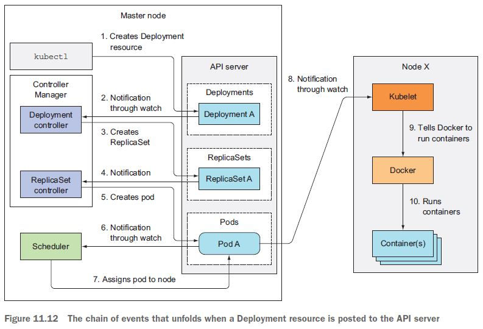

{: .center-image }

## Docker
> In short, containers are running systems defined by images. These images are made up of one or more layers (or sets of diffs) plus some metadata for Docker.

### Commands

> bash into a running container: 
```
docker exec -i -t dca6c76bd4e0 /bin/bash
```

> Run container
```
docker run --name kubia-container -p 8080:8080 -d kubia
```


## Kubernetes

### Commands
```
kubeadm token create --print-join-command
sudo kubeadm reset
```
```
kubectl exec ${POD_NAME} -c ${CONTAINER_NAME} -- ${CMD} ${ARG1} ${ARG2} ... ${ARGN}
```
```
kubectl get endpoints
```
```
kubectl rollout <restart, status, undo> deployment sample-dep
```
```
kubectl config view --raw -o json
```

## DevOps

> Deployment is a combination of two interrelated concepts: process and architecture.
>
> The adoption of DevOps means that the development team is also responsible for deploying their application or services.
>
> In some organizations, operations provides developers with a console for deploying their code. Or, better yet, once the tests pass, the deployment pipeline automatically deploys the code into production.

> If you want to deploy microservices at scale, you need a highly automated deployment process and infrastructure.

## Linux

### SSH
```
sudo apt install openssh-server
sudo systemctl status ssh
```
### Missing network connection
```
sudo touch /etc/NetworkManager/conf.d/10-globally-managed-devices.conf
sudo systemctl restart NetworkManager
```
### Can't start GUI
```
sudo apt install lightdm  
sudo dpkg-reconfigure lightdm   
sudo reboot
```
