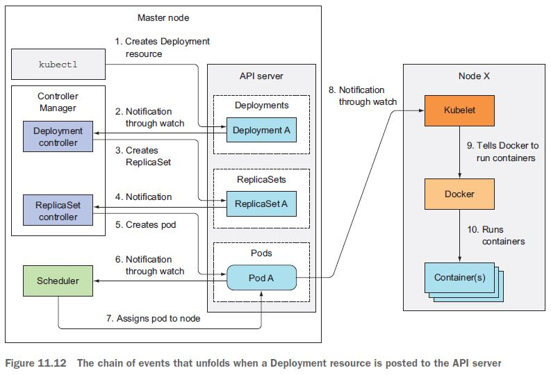

# Containerzation

    

            
    

    

        <h4 class="alert-heading">Docker</h4>
        
In short, containers are running systems defined by images. These images are made up of one or more layers (or sets of diffs) plus some metadata for Docker.

    

