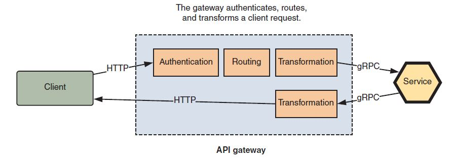

## List of questions you might need to consider to achieve production readiness

> Reliability — Is your service available and error free? 
Can you rely on your deployment process to push out new features without introducing instability or defects?
>  The behavior and state of a microservice should be observable, you should
be able to determine whether the service is healthy and whether it’s processing its
workload in the way you expect.
>
> Scalability — Do you understand the resource and capacity needs of a service? How will you maintain responsiveness under load?
>
> Transparency — Can you observe a service in operation through logs and metrics? If something goes wrong, is someone notified?
>
> Fault tolerance — Have you mitigated single points of failure? How do you cope with the failure of other service dependencies?

## Communication broker
> Kafka specializes in high-volume,
replayable event storage, whereas RabbitMQ provides higher level messaging
middleware (based on the AMQP protocol).

## Patterns for application boundaries:
> API gateways
>
> backends for frontends
>
> consumer-driven gateways
>
{: .center-image }
